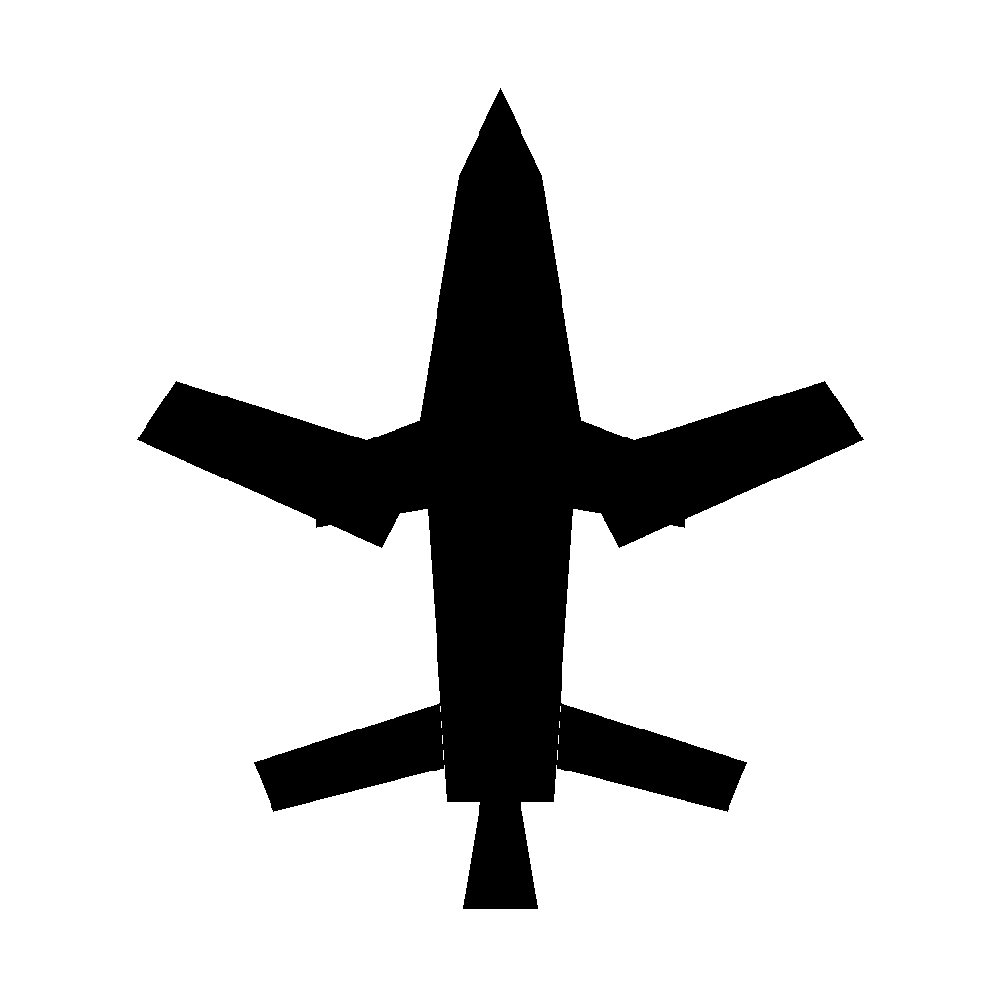

# <div align="center">SkelAI</div>

<div align="center">
  
</div>

<div align="center">
  
</div>

<div align="center">
  
  
  
  
</div>

<br />

## Overview

This repo contains a local working setup of the `SkeletonizationDrones` project.

- Flask serves the backend API
- React + Vite powers the frontend
- The current segmentation model behaves like a COCO-style detector, so `airplane`-like inputs work best for testing

## Quick Start

### 1. Clone the repo

```bash
git clone https://github.com/datawithdelio/SkeletonizationDrones.git
cd SkeletonizationDrones
```

### 2. Start the backend

```bash
cd backend
python3 -m venv .venv
source .venv/bin/activate
pip install -r requirements.txt
python app.py
```

Backend runs at:

```text
http://127.0.0.1:5001
```

### 3. Start the frontend

Open a second terminal window:

```bash
cd SkeletonizationDrones/frontend
npm install
npm run dev
```

Frontend dev server runs at:

```text
http://127.0.0.1:5173
```

## Fastest Way To Test

After both servers are running:

1. Open `http://127.0.0.1:5173` or `http://127.0.0.1:5001`
2. Upload `airplane_test.png`
3. Set confidence to `0.1` if needed
4. Click `Generate Skeleton`

## Project Layout

```text
SkeletonizationDrones/
├── backend/
│   ├── app.py
│   ├── run.py
│   ├── requirements.txt
│   └── skeleton_generation/
├── frontend/
│   ├── src/
│   ├── package.json
│   └── vite.config.js
├── airplane_test.png
└── README.md
```

## Notes

- The backend default port is `5001`
- The Vite frontend proxies API requests to the backend
- If port `5001` is busy, stop the existing process first with `lsof` and `kill`
- This repo is currently suitable for local development, not production deployment

## Troubleshooting

### Port 5001 is already in use

```bash
lsof -nP -iTCP:5001 -sTCP:LISTEN
kill <PID>
```

### `code` command is missing

In VS Code, run:

```text
Shell Command: Install 'code' command in PATH
```

### Upload does nothing

Try `airplane_test.png` first. The current model does not include a true `drone` class.

## Demo Assets

- `airplane_test.png`: local test input that has been verified with the current model
- `test_upload.png`: simple synthetic test image

<div align="center">
  
</div>

<div align="center">
  <sub>Built for local experimentation, debugging, and project demos.</sub>
</div>
